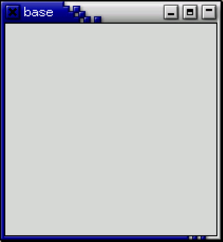

To begin our introduction to GTK, we'll start with the simplest program possible. This program will create a 200x200 pixel window and has no way of exiting except to be killed by using the shell.



``` ocaml
(* file: base.ml *)

let main () =
  let window = GWindow.window () in
  window#show ();
  GMain.Main.main ()

let _ = main ()
```

You can compile the above program with ocamlc using:

ocamlc -I +lablgtk2 -o base lablgtk.cma gtkInit.cmo base.ml

The meaning of the unusual compilation options is explained below in Compiling Hello World.

The first two lines of code create and display a window.

``` ocaml
  let window = GWindow.window () in
  window#show ();
```

Rather than create a window of 0x0 size, a window without children is set to 200x200 by default so you can still manipulate it.

The GWindow.window#show method lets GTK know that we are done setting the attributes of this widget, and that it can display it.

The last line enters the GTK main processing loop.

``` ocaml
  GMain.Main.main ()
```
[GMain.Main.main](../) is another call you will see in every GTK application. When control reaches this point, GTK will sleep waiting for events (such as button or key presses), timeouts, or file IO notifications to occur. In our simple example, however, events are ignored.

### Hello World in GTK

Now for a program with a widget (a button). It's the classic hello world a la GTK.

``` ocaml
(* file: hello.ml *)

(* This is a callback function. *)
let hello () =
  print_endline "Hello World";
  flush stdout

(* Another callback function.
 * If you return [false] in the "delete_event" signal handler,
 * GTK will emit the "destroy" signal. Returning [true] means
 * you don't want the window to be destroyed.
 * This is useful for popping up 'are you sure you want to quit?'
 * type dialogs. *)
let delete_event ev =
  print_endline "Delete event occurred";
  flush stdout;

  (* Change [true] to [false] and the main window will be destroyed with
   * a "delete event" *)
  true

let destroy () = GMain.Main.quit ()

let main () =
  (* Create a new window and sets the border width of the window. *)
  let window = GWindow.window ~border_width:10 () in

  (* When the window is given the "delete_event" signal (this is given
   * by the window manager, usually by the "close" option, or on the
   * titlebar), we ask it to call the delete_event () function
   * as defined above. *)
  window#event#connect#delete ~callback:delete_event;

  (* Here we connect the "destroy" event to a signal handler.  
   * This event occurs when we call window#destroy method
   * or if we return [false] in the "delete_event" callback. *)
  window#connect#destroy ~callback:destroy;

  (* Creates a new button with the label "Hello World".
   * and packs the button into the window (a gtk container). *)
  let button = GButton.button ~label:"Hello World" ~packing:window#add () in

  (* When the button receives the "clicked" signal, it will call the
   * function hello().  The hello() function is defined above. *)
  button#connect#clicked ~callback:hello;

  (* This will cause the window to be destroyed by calling
   * window#destroy () when "clicked".  Again, the destroy
   * signal could come from here, or the window manager. *)
  button#connect#clicked ~callback:window#destroy;

  (* The final step is to display the window. *)
  window#show ();

  (* All GTK applications must have a GMain.Main.main (). Control ends here
   * and waits for an event to occur (like a key press or
   * mouse event). *)
  GMain.Main.main ()

let _ = main ()
```
